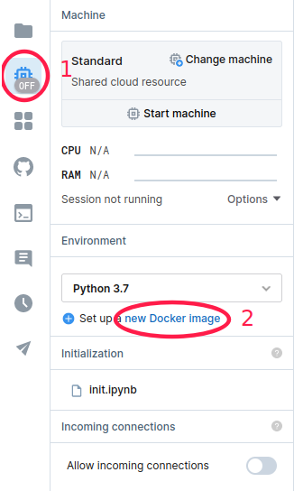
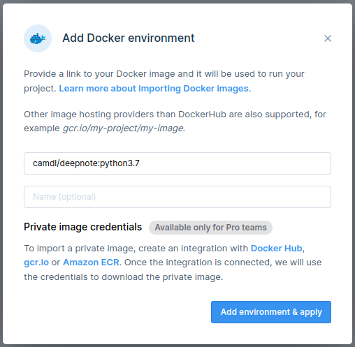
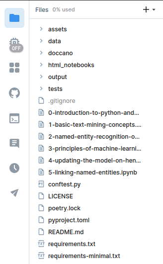
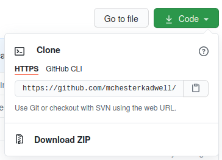
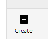
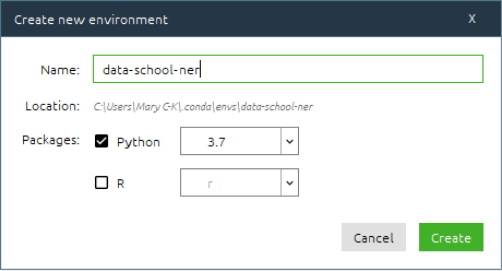
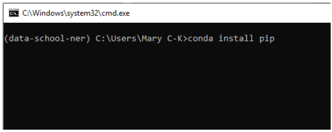
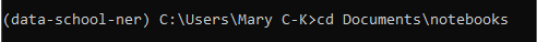
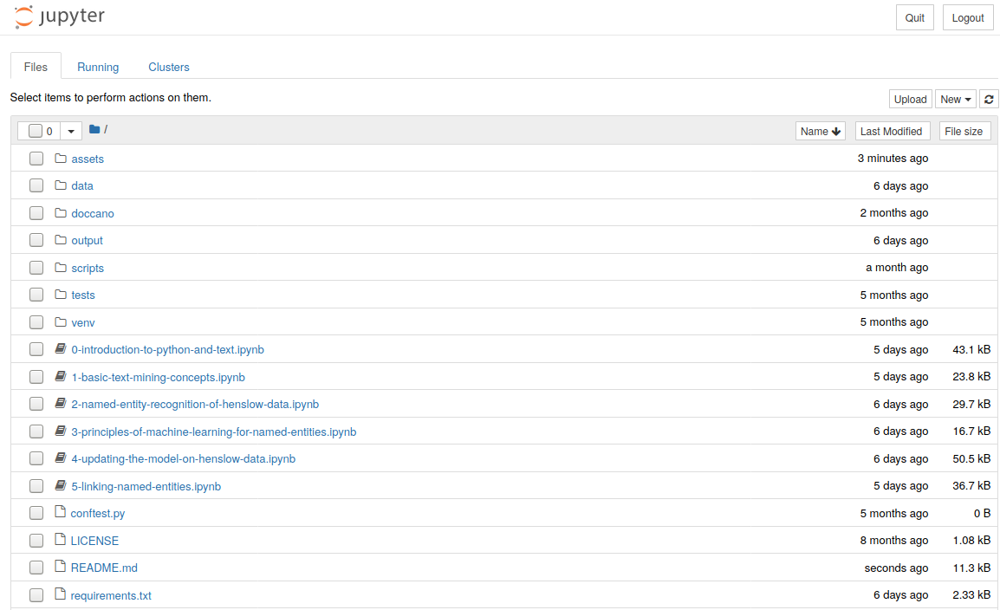

# Introduction to Named Entity Recognition with Python

[](https://www.python.org/downloads/release/python-378/)
[](https://www.python.org/downloads/release/python-386/)
[](https://mybinder.org/v2/gh/mchesterkadwell/named-entity-recognition/main)

## Introduction

This repository contains Jupyter notebooks used for teaching *'Text-mining with Python: Named Entity Recognition (NER)'*, 
a course in the annual [Cambridge Digital Humanities](https://www.cdh.cam.ac.uk/) (CDH) Cultural Heritage Data School.

The notebooks are designed to be worked on as self-paced materials in a 'flipped classroom' approach. They 
are also written as stand-alone notebooks for anyone to follow and use as they wish.

The aim is to teach basic NER techniques to a wide audience, and the material suitable both for those people who:
* Have some background in Python **or**
* Just want to learn about the concepts without programming. 
 
Please note that the notebooks are designed to be run as a teaching aid, not as a serious text analysis tool. 

### Contents

Using the example of some nineteenth-century letters of science, these notebooks introduce how to:

* **Automatically recognise** and **visualise** named entities using machine learning;
* **Train** machine learning models for improving results;
* **Link** named entities to existing knowledge bases or authorities.

### Recommended Pathways
 
 For non-coders, I recommend you start with the notebook 
 [2-named-entity-recognition-of-henslow-data](2-named-entity-recognition-of-henslow-data.ipynb) and skip over the 
 notebook [4-updating-the-model-on-henslow-data](4-updating-the-model-on-henslow-data.ipynb).
 
 If you’re a Python beginner, I recommend that you work through the first notebook 
 [0-introduction-to-python-and-text.ipynb](0-introduction-to-python-and-text.ipynb). It contains a brief refresher 
 of the basic Python you need to understand the NER examples, but I don’t expect it will be enough to teach you Python 
 from scratch.
 
 For everyone else, I recommend you start with notebook 
 [1-basic-text-mining-concepts.ipynb](1-basic-text-mining-concepts.ipynb) and work through the rest in order. 
 [4-updating-the-model-on-henslow-data.ipynb](4-updating-the-model-on-henslow-data.ipynb) is the most advanced Python in the course and is intended as a deep dive for those with a further interest in 
 working with spaCy. If you don’t understand everything here yet, feel free to run through it quickly or skip it. 

### Data and Licensing

Originally, these notebooks were delivered using data from the 
[Darwin Correspondence Project](https://www.darwinproject.ac.uk/), which we had permission to use within the 
context of the Data School. Unfortunately, the [CC-BY-NC-ND](http://creativecommons.org/licenses/by-nc-nd/4.0/) license 
under which the letters are licensed from Cambridge University Press allows for distribution of the letters, but not 
the creation of derivatives, which meant that the notebooks could not be published. I have re-written the notebooks 
using data from the [Henslow Correspondence Project](https://epsilon.ac.uk/search?sort=date;f1-collection=John%20Henslow;f2-correspondent=Henslow,%20J.%20S.) 
(HCP) instead, which is licensed more permissively with [CC-BY-NC](https://creativecommons.org/licenses/by-nc/4.0/). 

### Content Warning 

The HCP letters were written during the period of British imperialism, therefore some of the correspondence contains 
content we now find offensive, for example, `letters_138.xml` contains a racist description. These notebooks do not 
contain or discuss any of this material, but please be aware you may come across it if you browse through the letters 
independently.

## Quick Start: Launch Notebooks Online

### For a Quick Look: Run on Binder

[](https://mybinder.org/v2/gh/mchesterkadwell/named-entity-recognition/main)

If you just want to play quickly with the notebooks and see what they show, click on the "launch binder" button. 
Binder will launch a virtual environment in your browser where you can open and run the notebooks without installing 
anything. 

Limitations of Binder:

* Some cells in the notebooks may use more memory than Binder allows, causing the notebook's kernel to crash. After it 
has restarted, try modifying the code to process fewer documents.
* Binder may shut down after about 10 minutes of inactivity e.g. if you don't keep the window open. You can simply 
open a new Binder to start again.
* Binder will not save any changes you make to the notebooks.

### Run in the Cloud without any Installation: Run on Deepnote

[](https://deepnote.com/launch?url=https%3A%2F%2Fgithub.com%2Fmchesterkadwell%2Fnamed-entity-recognition)

To run and keep a copy of the notebooks for yourself, click on the "Launch in Deepnote" button. Deepnote will create 
a project based on this repository automatically and run in the cloud, so you don't have to install anything on your 
local computer.

After the project has started, go to the buttons on the left-hand side and click on the **Environment** button (1) to open
the Environment tab. In the Environment tab, click (2) **new Docker image**.



A dialog will pop up: type in `camdl/deepnote:python3.7` and then click **Add environment and apply**.



After a minute or two, Deepnote will start the new machine and run the install steps. Then the notebooks are ready to 
use. Click on the Folder icon to open the list of notebooks.



Limitations of Deepnote:

* Deepnote requires you to sign up for an account.
* Deepnote has a (generous) limit on the number of free hours you can use each month.
* On the free tier, the notebooks will likely run slower than on your own computer. 

## Local Installation

Please note these instructions are suitable if you already have Python installed in some way. If you have never 
installed Python yourself on your computer before, I recommend this guide: 
[Python 3 Installation & Setup Guide](https://realpython.com/installing-python/).

### Important!

The notebooks should run on any of the following versions of Python:

[](https://www.python.org/downloads/release/python-378/)
[](https://www.python.org/downloads/release/python-386/)

The notebooks have _not_ yet been updated to run on Python 3.9 and above. If you try to run them on 
Python 3.9 or above, you will get errors when you install the dependencies.

### Download or Clone the Files

Click the green "Code" button to the top-right of this page. 



If you have never used `git` version control before I recommend you simply download the notebooks with the 
"Download ZIP" option. In most operating systems this will automatically unzip it back into individual files. Move 
the folder to somewhere you want to keep it, such as "My Documents". 

If you have used `git` before, then you can clone the repo with this command:

`git clone https://github.com/mchesterkadwell/named-entity-recognition.git`

### Vanilla/Plain Python

If you installed Python from [python.org](https://www.python.org/downloads/) (or from the Windows Store) follow these 
instructions. 

If you are using PyCharm or another IDE with which you are already familiar, of course, do what you 
normally do instead to create a virtual environment and install dependencies.

#### _Mac & Linux_: Setting up the Notebook Server for the First Time

Open a Terminal and change directory into the notebooks folder by typing something like this:

`cd path/to/notebooks`

where `path/to/notebooks` is the filepath to wherever you’ve put the notebooks folder.

Then create a new virtual environment:

`python3 -m venv env`

Activate the virtual environment:

`source env/bin/activate`

Then install all the dependencies:

`pip install -r requirements.txt`

This should initiate a big list of downloads and will take a while to finish. Please be patient.

Finally, to start the notebook server type:

`jupyter notebook`

When you are finished with the notebook, press **ctrl+c** to stop the notebook server. Then type:

`deactivate`

You can close the Terminal window.

#### _Mac & Linux_: Starting the Notebook Server Again

Open a terminal and type something like this (pressing return between each line):

```
cd path/to/notebooks
source env/bin/activate
jupyter notebook
```

When you are finished with the notebook, press **ctrl+c** to stop the notebook server. Then type:

`deactivate`

You can close the Terminal window.

#### _Windows_: Setting up the Notebook Server for the First Time

Open a Command Prompt and change directory into the notebooks folder by typing something like this:

`cd path\to\notebooks`

where `path\to\notebooks` is the filepath to wherever you’ve put the notebooks folder.

Then create a new virtual environment:

`python -m venv env`

Activate the virtual environment:

`env\Scripts\activate.bat`

Then install all the dependencies:

`pip install -r requirements.txt`

This should initiate a big list of downloads and will take a while to finish. Please be patient.

Finally, to start the notebook server type:

`jupyter notebook`

When you are finished with the notebook, press **ctrl+c** to stop the notebook server. Then type:

`deactivate`

You can close the Command Prompt window.

#### _Windows_: Starting the Notebook Server Again

Open a Command Prompt and type something like this (pressing return between each line):

```
cd path\to\notebooks
env\Scripts\activate.bat
jupyter notebook
```

When you are finished with the notebook, press **ctrl+c** to stop the notebook server. Then type:

`deactivate`

You can close the Command Prompt window.

### Anaconda

If you installed Python with Anaconda from [Anaconda.com](https://www.anaconda.com/products/individual) follow these 
instructions.

#### Setting up the Notebook Server for the First Time

Open Anaconda Navigator. In **Anaconda Navigator > Environments** click on the ‘Create’ button in the bottom left of the 
Environments list.



Type a name e.g. 'data-school-ner', make sure that 'Python' is _checked_ 
and under the dropdown pick '3.7' or '3.8'. Make sure that 'R' is left _unchecked_. 

Then click the ‘Create’ button. 



It will take a few seconds to set up...

Then in **Anaconda Navigator > Environments** make sure you have selected your new environment. 

On the right of the environment name is a small green play arrow. Click on it and pick ‘Open Terminal’ from the 
dropdown.

In the Terminal that opens type the following, and press return:

`conda install pip`



If you do not already have pip installed, it will install it. Otherwise it will give a message:

`# All requested packages already installed.`

Then change directory to wherever you saved the notebooks folder by typing something like:

`cd \path\to\notebooks`

where `path\to\notebooks` is the filepath to wherever you’ve put the notebooks folder.

If you are on **Mac or Linux**, make sure to use forward slashes in the filepath instead e.g. `path/to/notebooks`



Then install all the dependencies by typing:

`pip install -r requirements.txt`

This should initiate a big list of downloads and will take a while to finish. Please be patient.

Finally, to launch the Jupyter notebook server type:

`jupyter notebook`

It should automatically open a browser window with the notebook listing in it, a bit like this:



If not, you can copy and paste one of the URLs in the Terminal window into your browser e.g. 
http://localhost:8888/?token=ddb27d2a1a6cb29a3483c24d6ff9f7263eb9676f02d71075
(This example will not work on your machine, as the token is unique every time!)

When you are finished with the notebook, press **ctrl+c** to stop the notebook server. 

You can close the Terminal window.

#### Starting the Notebook Server Again

Next time you want to start the notebook server:

In **Anaconda Navigator > Environments** make sure you have selected your new environment e.g. 'data-school-ner'. 

On the right of the environment name is a small green play arrow. Click on it and pick ‘Open Terminal’ from the 
dropdown.

To launch the Jupyter notebook server type:

`jupyter notebook`

When you are finished with the notebook, press **ctrl+c** to stop the notebook server. You can close the Terminal 
window.